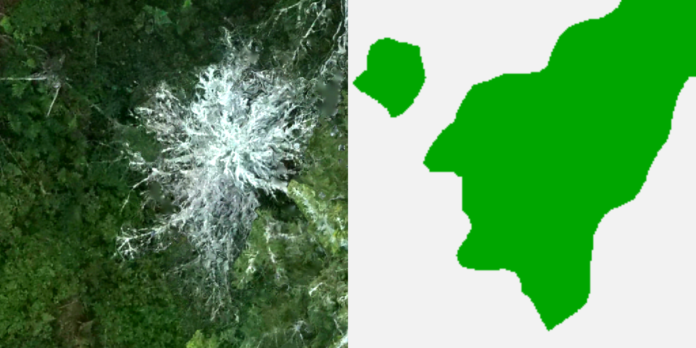

```{r setup, include=FALSE}
knitr::opts_chunk$set(echo = TRUE)
```

<br><br>

In this tutorial you will learn how to map deadwood from RGB drone imagery using Deep Learning.
The data used in this tutorial can be found [here](https://bwstaff-my.sharepoint.com/personal/felix_schiefer_bwstaff_de/_layouts/15/onedrive.aspx?id=%2Fpersonal%2Ffelix%5Fschiefer%5Fbwstaff%5Fde%2FDocuments%2FRS%5FTutorials%2FDeepLearning)

In this tutorial we will use R.

A step-by-step guide how to install tensorflow can be found [here]() 

<br><br>

# Overview {#overview}


1. [Data acquisition](#data)
    + [UAV flights](#UAV)
    + [Delineation](#label)
2. [Prepare the data](#prep)
    + [Tiling](#tile)
    + [Data spliting](#split)
    + [Tfdataset input pipeline](#pipeline)
3. [CNN-based deadwood mapping](#CNN)
    + [U-net](#unet)
    + [Training](#train)
    + [Accuracy assesment](#accuracy)
    + [Prediction](#prediction)

***

<br><br>

# Data acquisiton {#data}

### UAV flights {#UAV}

### Data labeling {#label}


For this tutorial you don't need to conduct any UAV flights or reference data labeling and you can go directly to this [link](https://bwstaff-my.sharepoint.com/personal/felix_schiefer_bwstaff_de/_layouts/15/onedrive.aspx?id=%2Fpersonal%2Ffelix%5Fschiefer%5Fbwstaff%5Fde%2FDocuments%2FRS%5FTutorials%2FDeepLearning) and download the data. The UAV imagery is stored in the subfolder *UAV*, whereas the deadwood polygons can be found in the subfolder *delineation*. 

***

<br><br>

# Data preparation {#prep}

To begin, we first need to load the required packages and functions:

```{r packages, eval=FALSE}
pkgs <- c("raster", "rgdal")
sapply(pkgs, require, character.only = TRUE)
```


```{r load-data, results='hide', warning=FALSE, }
dataDir  <- "C:/Users/FeSch/Desktop/TutTest/"
sites    <- list.files(path = dataDir, pattern = "tif", recursive = T, full.names = T)

# load first scene of drone imagery
uav      <- raster::stack(sites[1])

# load area of interest
AOI      <- rgdal::readOGR(dsn = "C:/Users/FeSch/Desktop/TutTest/sites/study_sites.shp")

# load deadwood delineation
deadwood <- rgdal::readOGR(dsn = "C:/Users/FeSch/Desktop/TutTest/delineation/poly_deadwood.shp")
```

We crop the raster stack to the area of interest and plot the results. 

```{r crop-and-plot, eval=FALSE}
# AOI <- AOI[AOI$plot_no == AOI$plot_no[1], ]

uav  <- crop(uav, AOI)

# histogram stretch 
q   <- quantile(uav, probs = c(.001, .999))
uav <- (uav - min(q[,1])) * 255 / (max(q[,2]) - min(q[,1]))
beginCluster()
uav <- clusterR(uav, fun = reclassify, args = list(rcl = c(-Inf,0,0, 255,Inf,255)),
                datatype = "INT1U")
endCluster()

# plot
plotRGB(uav)
lines(AOI, col = "red", lwd = 3)
lines(deadwood, col = "yellow", lwd = 2)
```

<center>


</center>

### Tiling {#tile}

Due to memory limitations of the CPU or GPU we cannot train our CNN with the entire orthomosaic. Therefore, we first need to segment the orthomosaic into smaller tiles. For each RGB tile also the corresponding deadwood mask is required.

```{r sample-positions, warning=FALSE, eval = FALSE}
library(raster)

# define kernel size
tilesize <- 512L

kernelSizeX <- tilesize * xres(uav)
kernelSizeY <- tilesize * yres(uav)

# create sample positions
xOffset <- (ncol(uav)/1024 - floor(ncol(uav)/1024))/2 * 1024 * xres(uav)
yOffset <- (nrow(uav)/1024 - floor(nrow(uav)/1024))/2 * 1024 * yres(uav)
    
x <- seq(extent(uav)[1] + kernelSizeX/2 + xOffset,
         extent(uav)[2] - kernelSizeX/2 - xOffset,
         kernelSizeX)
y <- seq(extent(uav)[3] + kernelSizeY/2 + yOffset,
         extent(uav)[4] - kernelSizeY/2 - yOffset,
         kernelSizeY)

XYpos <- expand.grid(x, y)
XYpos <- SpatialPointsDataFrame(coords = XYpos, proj4string = crs(AOI), data = XYpos)
XYpos <- XYpos[AOI,]

# superimpose the sample positions on the previous plot
points(XYpos, pch = 3, col = "orange")

XYpos <- as.data.frame(XYpos)[,c(1,2)]
XYpos <- cbind(XYpos[,1] - kernelSizeX/2,
               XYpos[,1] + kernelSizeX/2,
               XYpos[,2] - kernelSizeY/2,
               XYpos[,2] + kernelSizeY/2)
```


<center>


</center>

```{r mask, eval = FALSE}
bg            <- AOI
bg$species_ID <- 0
bg@data       <- data.frame(species_ID = bg@data$species_ID, row.names = rownames(bg@data))
if(!is.null(deadwood)) {
  bg        <- erase(bg, deadwood)
  mask      <- union(bg, deadwood)
  mask$species_ID.1[!is.na(mask$species_ID.2)] <- mask$species_ID.2[!is.na(mask$species_ID.2)]
  mask@data <- data.frame(species_ID = mask@data[,1])
} else {
  mask      <- bg
}

plot(mask, col = mask$species_ID+7)
```

<center>


</center>

```{r tiling, eval = FALSE}

site   <- paste0("S", sprintf("%03d", 1))
outDir <- "C:/Users/FeSch/Desktop/TutTest/"

for(i in 1:nrow(XYpos)) {
  
  cropExt <- extent(XYpos[i,])
  
  # crop orthomosaic
  uavCrop <- crop(uav, cropExt)
  uavCrop <- crop(uavCrop, extent(uavCrop, 1, tilesize, 1, tilesize)) # remove rounding artifacts
  
  # crop mask
  polyCrop <- crop(mask, cropExt)
  
  if(length(polyCrop) > 0) { # rasterize shapefile if polygons exist 
    polyCropR  <- rasterize(polyCrop, uavCrop[[1]], field = polyCrop$species_ID)
    
    NAidx      <- which(is.na(values(polyCropR)))
    flagPolyNA <- length(NAidx) < 2500
    # TRUE if NAValues exist AND no less then 2500 (50*50 pixel = 1m2) in crop
    flagOrtho  <- length(which(is.na(values(uavCrop[[1]])) == TRUE)) == 0
    # TRUE if no NA in crop
  } else {
    flagPolyNA <- flagOrtho <- FALSE
  }
  
  
  if(flagOrtho && flagPolyNA) {
    
    # fill NA values
    if(length(NAidx) > 0) {
      
      rows <- rowFromCell(polyCropR, NAidx)
      cols <- colFromCell(polyCropR, NAidx)
      
      left <- cols-floor(40/2); left[left < 1] = 1
      top  <- rows-floor(40/2); top[top < 1] = 1
      
      for(k in 1:length(NAidx)) {
        vals                <- getValuesBlock(polyCropR, row = top[k],
                                              nrow = 40, col = left[k], ncol = 40)
        polyCropR[NAidx[k]] <- as.numeric(names(table(vals)[1]))
      }
    }
    
    extent(uavCrop)   <- extent(0, kernelSizeX, 0, kernelSizeY)
    extent(polyCropR) <- extent(0, kernelSizeX, 0, kernelSizeY)
    
    uavCrop   <- as.array(uavCrop)
    polyCropR <- as.array(polyCropR)
    
    uavCrop   <- magick::image_read(uavCrop / 255)
    polyCropR <- magick::image_read(polyCropR / 255)
    
    imgName <- paste0(outDir, "img/", site, "_img", sprintf("%03d", i), ".png")
    mskName <- paste0(outDir, "msk/", site, "_msk", sprintf("%03d", i), ".png")
    magick::image_write(uavCrop, format = "png", path = imgName)
    magick::image_write(polyCropR, format = "png", path = mskName)
    
    }
}

```

To check if everything went well, we can read some of the extracted tiles and plot them together with the mask.

```{r check-tiling, eval = FALSE, fig.height=4, fig.width=8}
library(raster)

img <- stack("C:/Users/FeSch/Desktop/TutTest/img/S001_img297.png")
msk <- raster("C:/Users/FeSch/Desktop/TutTest/msk/S001_msk297.png")

par(mfrow = c(1,2), mar = c(0,1,0,1))
plotRGB(img)
plot(as.raster(msk))

```

<center>



</center>

### Data spliting {#split}


### Input pipeline {#pipeline}

***

<br><br>

# CNN-based deadwood mapping {#CNN}

### U-net {#unet}

### Training {#train}

### Accuracy assesment {#assessment}

### Prediction {#prediction}